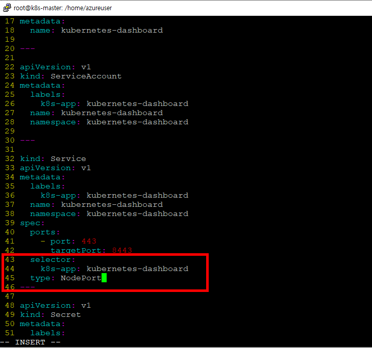
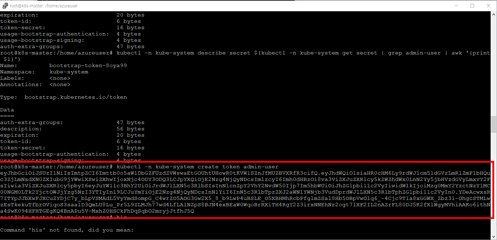
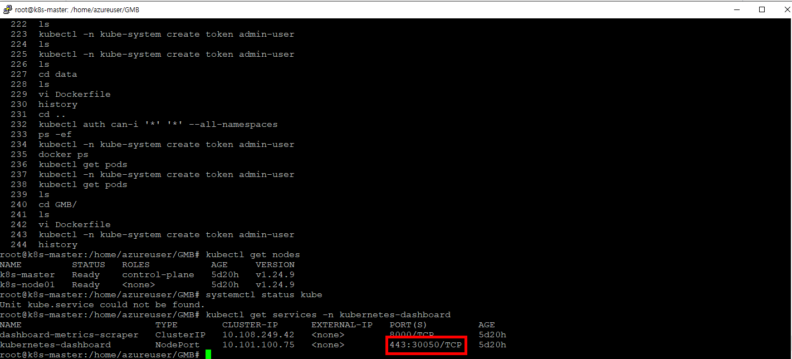
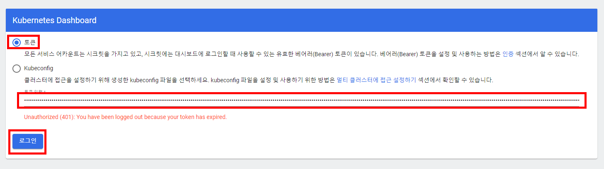
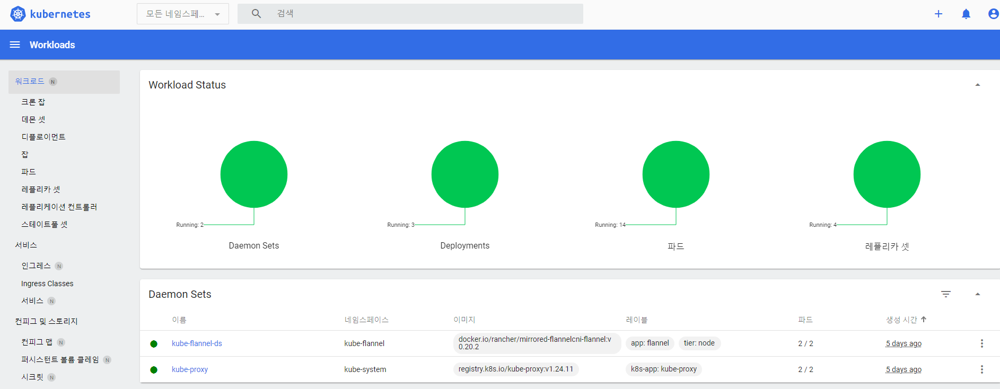

# K8S
쿠버네티스는 1.24버전 이후로 부터 Docker 지원이 되지 않는다. 정확히 말하자면 Docker를 컨테이너 런타임으로 쓸 수 없다는 것이지 이미지는 쓸 수 있다.<br/>
따라서 containerd 또는 CRI-O와 같은 다른 런타임으로 전환해야 한다.<br/>


## 가상머신
```
Azure
k8s-master  2c  8g  Linux (ubuntu 20.04)
k8s-node01  2c  8g  Linux (ubuntu 20.04)
k8s 최소 사양 2c 2g
```

## K8S 설치
### Docker 설치
```shell
apt-get update
apt-get install     ca-certificates     curl     gnupg     lsb-release
mkdir -m 0755 -p /etc/apt/keyrings

curl -fsSL https://download.docker.com/linux/ubuntu/gpg | sudo gpg --dearmor -o /etc/apt/keyrings/docker.gpg

echo   "deb [arch=$(dpkg --print-architecture) signed-by=/etc/apt/keyrings/docker.gpg] https://download.docker.com/linux/ubuntu \
  $(lsb_release -cs) stable" | sudo tee /etc/apt/sources.list.d/docker.list > /dev/null

apt-get update
sudo apt-get install docker-ce docker-ce-cli containerd.io docker-buildx-plugin docker-compose-plugin

systemctl status docker
swapoff -a && sed -i '/swap/s/&/#/' /etc/fstab

## 방화벽 끄기
ufw disable
```

### K8S 설치 (k8s-master, k8s-node01)
```shell
cat <<EOF | sudo tee /etc/sysctl.d/k8s.conf
net.bridge.bridge-nf-call-ip6tables = 1
net.bridge.bridge-nf-call-iptables = 1
EOF

sysctl --system


apt-get update && sudo apt-get install -y apt-transport-https ca-certificates curl


sudo curl -fsSLo /usr/share/keyrings/kubernetes-archive-keyring.gpg https://packages.cloud.google.com/apt/doc/apt-key.gpg

echo "deb [signed-by=/usr/share/keyrings/kubernetes-archive-keyring.gpg] https://apt.kubernetes.io/ kubernetes-xenial main" | sudo tee /etc/apt/sources.list.d/kubernetes.list

apt-get update

## k8s 버전 확인
apt-cache madison kubelet


## k8s 설치
sudo apt-get install -y kubelet=1.24.9-00                      kubeadm=1.24.9-00                      kubelet=1.24.9-00

## 버전 고정
apt-mark hold kubelet kubeadm kubectl
systemctl daemon-reload
systemctl restart kubelet


cat <<EOF | sudo tee /etc/docker/daemon.json
{
"exec-opts": ["native.cgroupdriver=systemd"],
"log-driver": "json-file",
"log-opts": {
"max-size": "100m"
},
"storage-driver": "overlay2"
}
EOF


systemctl enable docker
systemctl daemon-reload
systemctl restart docker

## 설정 변경
vi /etc/containerd/config.toml
```
<br/>


```shell
## 재시작
systemctl restart containerd
```


### K8S Master 쿠버네티스 서버 실행
```shell
##
kubeadm init
kubeadm reset
kubeadm init --pod-network-cidr=10.244.0.0/16 ## 여기서 나온 코드는 노드들 연결할때 쓴다.
```
<br/>

### CNI 플러그인 Flannel 설치(k8s-master)
Flannel은 쿠버네티스 내부에서 Pod간 통신을 위한 CNI 플러그인중 하나다. 다른 플러그인으로는 Calico가 있다.<br/>
```shell
mkdir -p $HOME/.kube
sudo cp -i /etc/kubernetes/admin.conf $HOME/.kube/config
sudo chown $(id -u):$(id -g) $HOME/.kube/config
kubectl apply -f https://raw.githubusercontent.com/flannel-io/flannel/v0.20.2/Documentation/kube-flannel.yml
```


### K8S Node 연결
```shell
## Master에서 init해서 나온 코드
kubeadm join 10.0.0.6:6443 --token 4571bz.53gjbwsqoorgp0vl         --discovery-token-ca-cert-hash sha256:c904395cc6ffc08f499c78f03e9c5399e17707982192f2cd9687607dc02e1ee9
```
<br/>

### K8S Master 와 Node 연결 확인
```shell
kubectl get nodes # k8s-node01이 Ready 상태면 성공
```
<br/>

## K8S 대시보드 설치

```shell
wget https://raw.githubusercontent.com/kubernetes/dashboard/v2.6.1/aio/deploy/recommended.yaml # 버전 확인해준다.
vi recommended.yaml

# type: NodePort 추가

kubectl apply -f recommended.yaml
kubectl get services -n kubernetes-dashboard
ufw disable
```
<br/>


### K8S 대시보드 토큰 생성
```shell
cat <<EOF | kubectl create -f -
 apiVersion: v1
 kind: ServiceAccount
 metadata:
   name: admin-user
   namespace: kube-system
EOF

cat <<EOF | kubectl create -f -
 apiVersion: rbac.authorization.k8s.io/v1
 kind: ClusterRoleBinding
 metadata:
   name: admin-user
 roleRef:
   apiGroup: rbac.authorization.k8s.io
   kind: ClusterRole
   name: cluster-admin
 subjects:
 - kind: ServiceAccount
   name: admin-user
   namespace: kube-system
EOF

kubectl -n kube-system create token admin-user  # 나온 토큰번호 저장
```
<br/>

### 대시보드 접속
```shell
### 대시보드 포트번호 확인
kubectl get services -n kubernetes-dashboard
```
<br/>

url 예시 : https://20.249.73.102:30050<br/>
다음과 같이 쿠버네티스 서버 IP:포트로 접속한다. 토큰 번호를 넣어주면 접속 가능하다.<br/>
<br/>
<br/>


